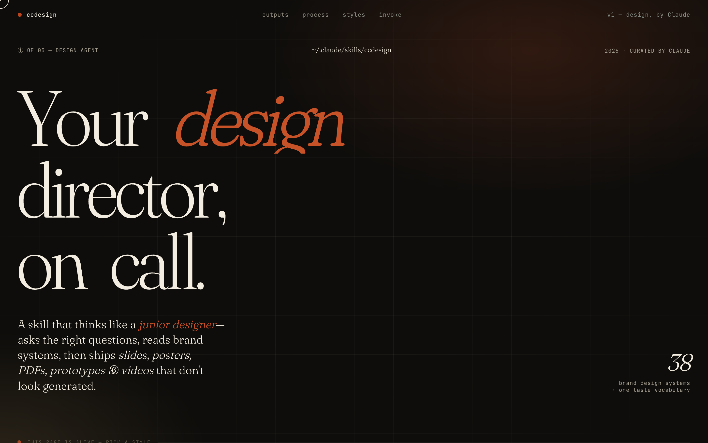
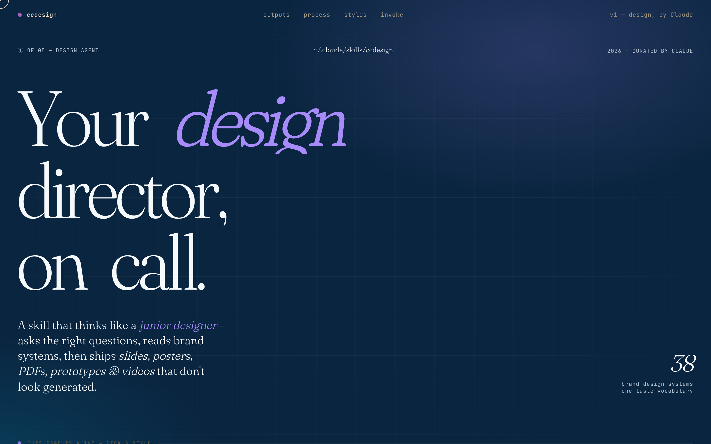
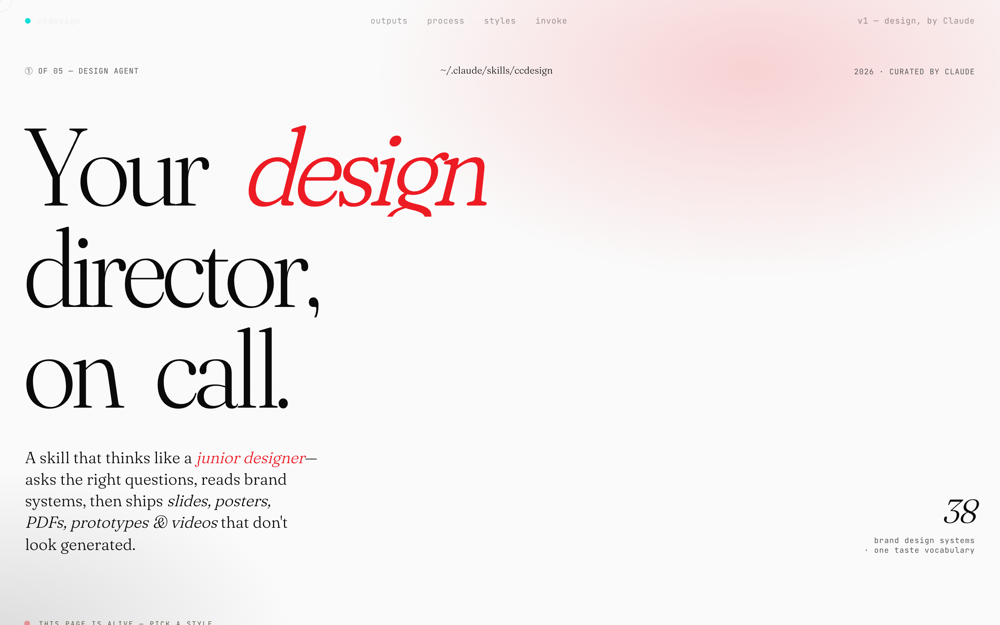
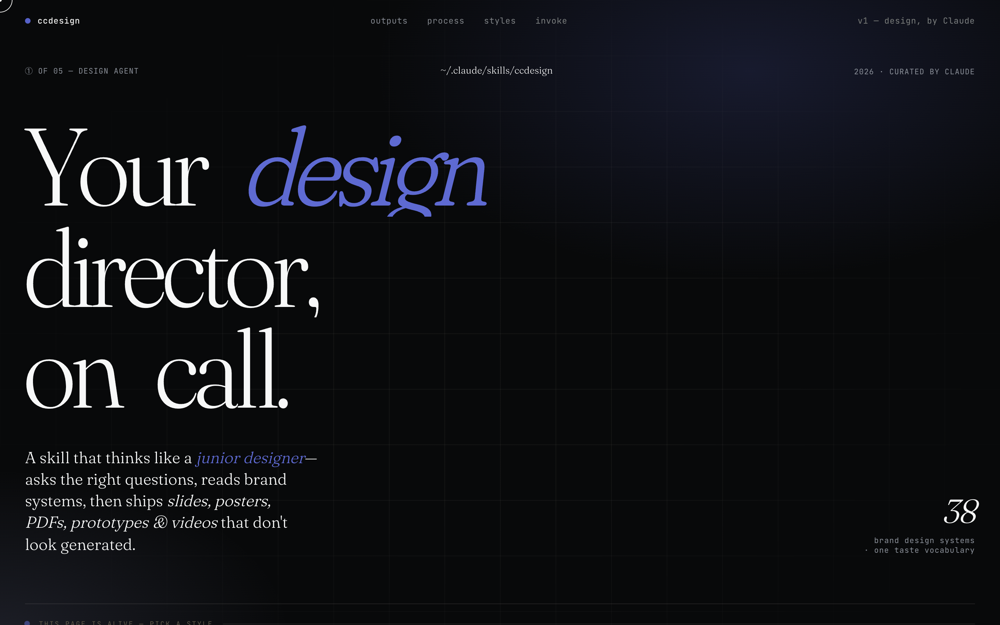
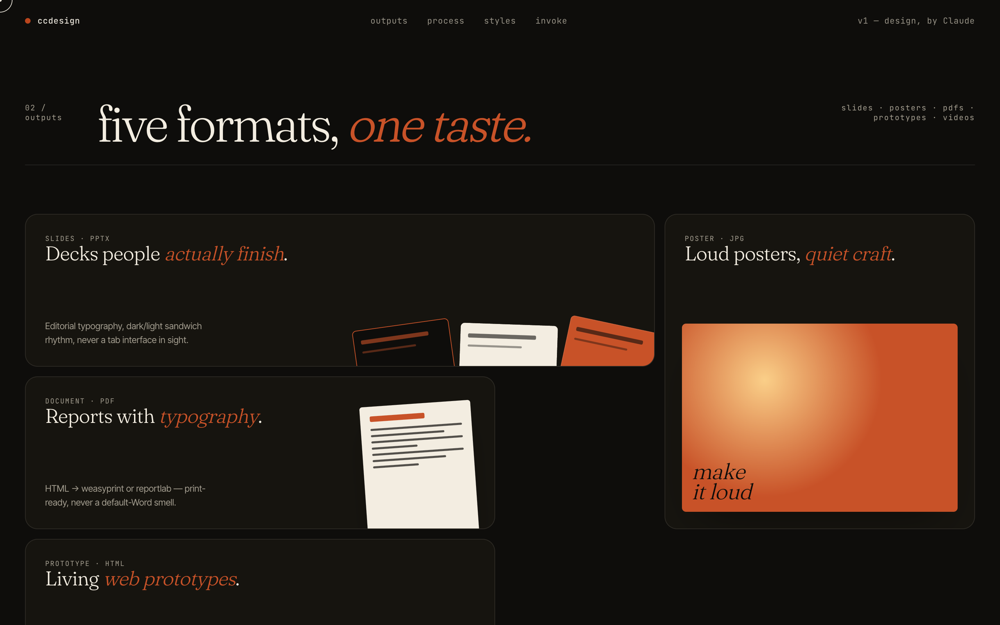
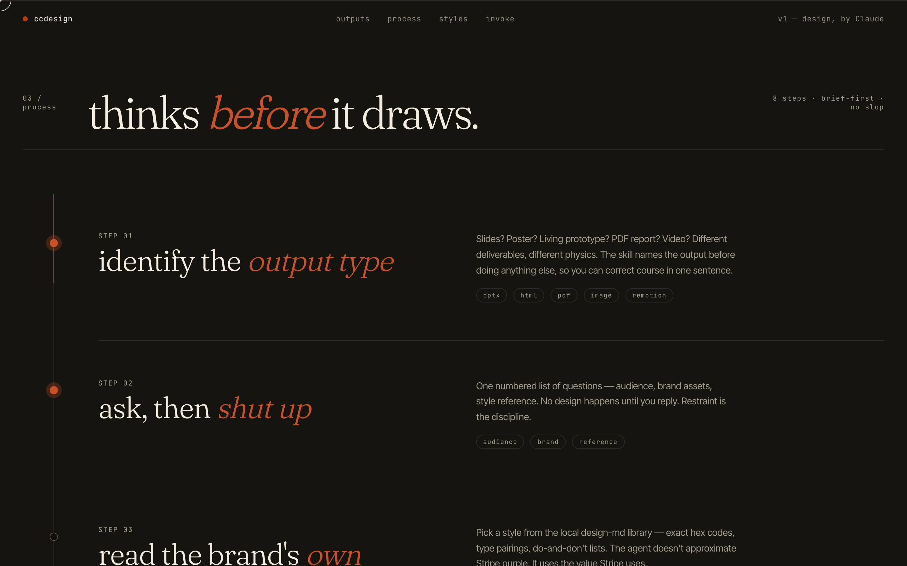
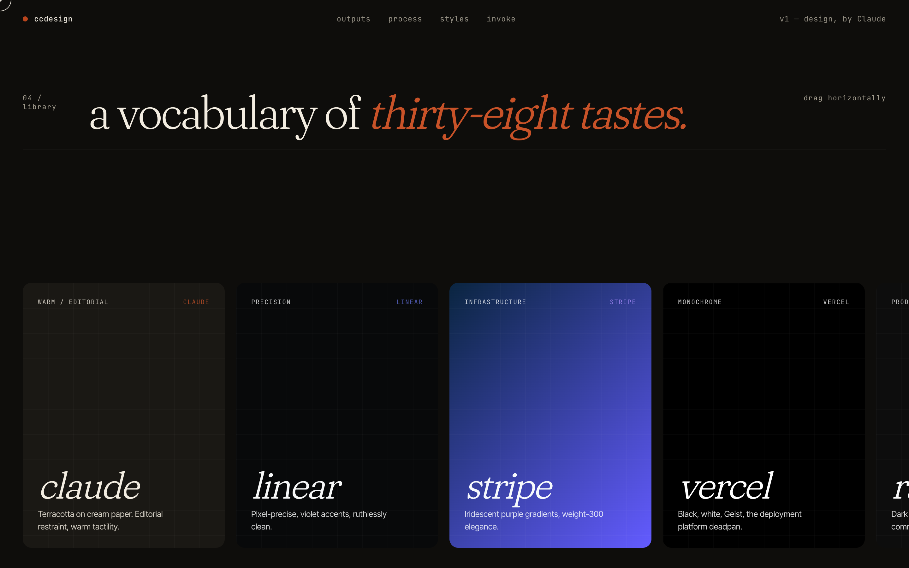
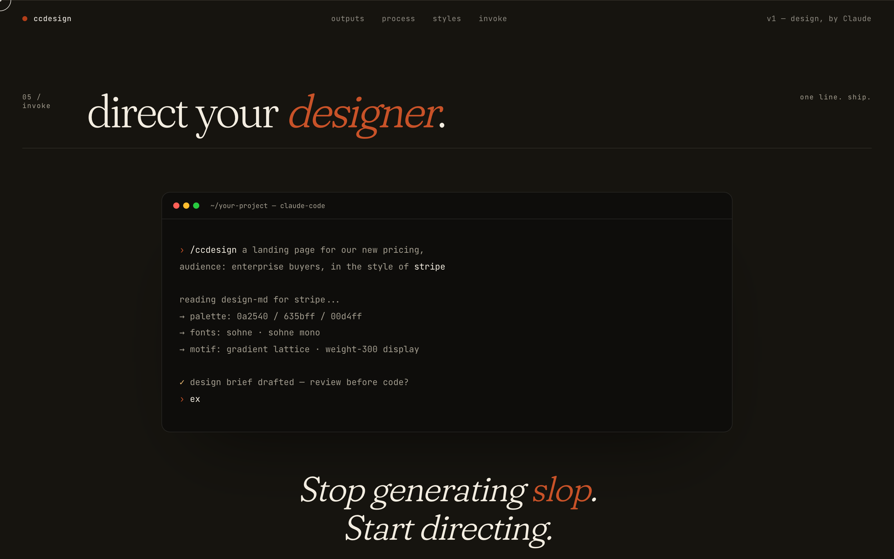

<p align="center">
  
</p>

<div align="center">

# ccdesign.skill

**A Claude Code skill that turns you into a creative director.**  
Tell it what to make. It thinks like a designer, not a code generator.

</div>

---

## Showcase — A landing page for the skill itself

The skill was asked to design a landing page for *itself*, deciding the style, components, layout, and interactions on its own. The result lives in [`examples/ccdesign-landing.html`](examples/ccdesign-landing.html). The page's signature interaction *is* the skill's signature: click any chip in the hero and the entire page — palette, accents, gradients — reflows live, because that is exactly what the skill does when it reads a brand's `DESIGN.md`.

<p align="center">
  
</p>

**Same hero, three live themes — one click each:**

<p align="center">
  
  
  
</p>

**Five output formats, each with its own micro-animation on hover:**

<p align="center">
  
</p>

**An eight-step process timeline driven by scroll-scrub:**

<p align="center">
  
</p>

**A vocabulary of thirty-eight tastes — drag to scroll horizontally:**

<p align="center">
  
</p>

**Direct your designer — terminal CTA:**

<p align="center">
  
</p>

**Under the hood:** Fraunces + Inter Tight + JetBrains Mono · CSS variables for live theming · GSAP + ScrollTrigger for scroll-scrub · IntersectionObserver as the reveal fallback · vanilla-JS magnetic cursor and 3D perspective tilt · Web Animations API for the theme-flash sweep.

To run it locally:

```bash
cd examples && python3 -m http.server 8080
open http://localhost:8080/ccdesign-landing.html
```

---

## What It Does

`/design` is a single entry point for all visual creation tasks. You describe what you want — slides for investors, a landing page, a poster, a PDF report — and the skill handles design decisions (color, typography, layout, variants) before delegating to format-specific tools.

**Output types:**

| Request | Output |
|---------|--------|
| PPT / deck / 幻灯片 | `.pptx` via PptxGenJS |
| Landing page / prototype / 落地页 | Standalone `.html` |
| Poster / cover / 小红书封面 | Fixed-px `.html` → screenshot |
| Document / report / 手册 | Print-ready `.html` → `.pdf` |
| Animation / video / 动画 | Remotion project |

---

## 54 Built-in Design Systems

The skill ships with offline DESIGN.md files for 54 brands — no network request needed.

**AI / LLM:** `claude` · `x.ai` · `elevenlabs` · `mistral.ai` · `ollama` · `replicate` · `minimax` · `together.ai` · `voltagent` · `cohere`

**Minimal / Engineer:** `notion` · `linear` · `vercel` · `stripe` · `resend` · `cal` · `expo` · `opencode.ai`

**Dark / Tech:** `cursor` · `raycast` · `superhuman` · `warp` · `spacex` · `nvidia` · `sentry` · `runwayml`

**Creative / Playful:** `figma` · `framer` · `lovable` · `clay` · `miro` · `posthog` · `zapier` · `webflow` · `airtable`

**Enterprise:** `apple` · `ibm` · `airbnb` · `intercom` · `hashicorp` · `mongodb` · `sanity`

**Finance:** `coinbase` · `revolut` · `wise` · `kraken`

**Other:** `spotify` · `mintlify` · `supabase` · `uber` · `pinterest` · `composio` · `clickhouse` · `bmw`

Each file contains: exact hex codes, font pairings, spacing scale, component styling, do's and don'ts.

---

## How It Works

```
You: /design 给我做个 SaaS 产品落地页，Notion 风格
```

The skill will:

1. Classify the output type (Prototype → HTML)
2. Ask 3–5 targeted questions (audience, content, interactive or static)
3. Read `design-md/notion/DESIGN.md` locally (no network call)
4. State every design decision out loud before writing code
5. Generate 3 variants (conservative → standard → bold)
6. Open each in browser, screenshot, show side-by-side
7. Export the one you pick

---

## Installation

```bash
git clone https://github.com/xixicc186/ccdesign.skill ~/.claude/skills/design
```

Then in Claude Code:

```
/design [your request]
```

---

## Design Philosophy

- **No AI slop** — no gradient soup, no emoji decoration, no Inter as a display font, no left-border accent cards
- **Brand fidelity** — reads the actual design spec, not a summary
- **3 variants minimum** — conservative, standard, bold — so you can choose, not just accept
- **Explains decisions** — "V1 uses deep navy + cream for authority; V2 uses coral for energy" — you stay in control
- **Delegates correctly** — design skill owns aesthetics; pptx/pdf/remotion skills own technical generation

---

## Dependencies

The skill delegates to other skills for file generation. Install them if needed:

- `pptx` skill — for `.pptx` output
- `pdf` skill — for `.pdf` output
- `remotion` skill — for video output

---

## License

MIT
